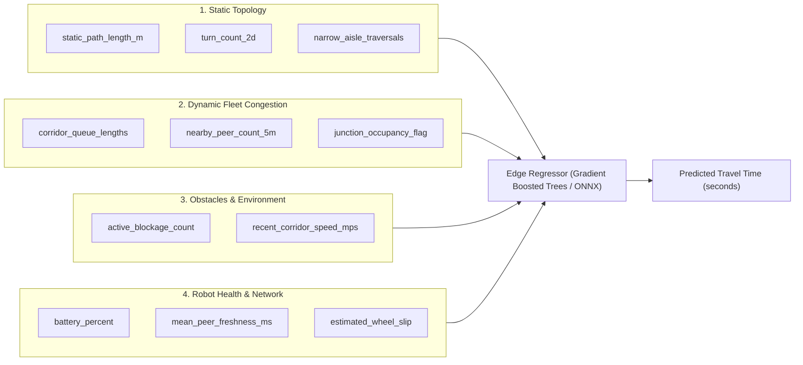

# End-to-End Architecture: ML ETA & Fleet Congestion Prediction

---

## 1. Core Architectural Role & Safety Boundary

```text
                               ┌────────────────────────────────────────┐
                               │       Edge ML / ETA Predictor          │
                               │  "How long will this traversal take?"  │
                               └──────────────────┬─────────────────────┘
                                                  │ Soft advisory cost (ETA in seconds)
                                                  ▼
┌────────────────────────┐              ┌──────────────────┐              ┌────────────────────────┐
│  CBBA Task Allocation  │              │ WHCA* Space-Time │              │   Safety Supervisor    │
│  "Who gets the task?"  │              │  Macro Planning  │              │   "Hard Sensor Veto"   │
│ (Bidding cost function)│              │  (Route choice)  │              │  (LiDAR / E-Stop / TTC)│
└────────────────────────┘              └──────────────────┘              └────────────────────────┘
          ▲                                      ▲                                    ▲
          │                                      │                                    │
   EFFICIENCY LAYER                       COORDINATION LAYER                     SAFETY LAYER
   (ML advisory input)                    (WHCA* + Mutex)                   (NO ML — Strictly Classical)
```

### The Architectural Invariants:
1. **Advisory, Never Authoritative:** The ML model is an efficiency booster, not a safety controller. It outputs a predicted duration ($\hat{y} \in \mathbb{R}^+$).
2. **Deterministic Fallback Invariant:** If the model inference exceeds $10\text{ ms}$, throws an exception, or reports low confidence, the pipeline instantly falls back to:
   $$\text{Baseline Cost} = \frac{\text{StaticGridDistance}}{v_{\text{nominal}}}$$
3. **No Motor Control:** ML never touches `/cmd_vel` or braking envelopes.

---

## 2. Model Feature Vector (Input at Inference Time)

At the moment an AMR bids on a task in CBBA or chooses a macro-route in WHCA\*, it constructs an input feature vector $X \in \mathbb{R}^{12}$ using **only information available at that exact millisecond (zero future-data leakage)**:



### Exact Feature Specification:

| Feature Name | Type | Description | Why the ML Model Needs It |
| :--- | :---: | :--- | :--- |
| `static_path_length_m` | `float` | 2D collision-free grid distance via aisles ($m$). | Baseline spatial scale. |
| `turn_count_2d` | `int` | Number of 90° turns along candidate route. | Turns require angular deceleration/acceleration. |
| `narrow_aisle_traversals` | `int` | Number of single-robot mutex zones (`NC-*`) crossed. | High risk of Ricart–Agrawala queuing delays. |
| `candidate_corridor_queue` | `int` | Number of AMRs currently waiting/granted in that corridor. | Captures queuing bottleneck non-linearly. |
| `nearby_peer_count_5m` | `int` | Active AMRs within a $5\text{ m}$ radius. | Predicts ORCA local avoidance velocity throttling. |
| `junction_occupancy_flag` | `binary` | Is the target junction (`J-*`) currently reserved? | Prevents entering a gridlocked intersection. |
| `active_blockage_count` | `int` | Active LiDAR blockages observed in that sector. | Captures detours around temporary obstacles. |
| `recent_corridor_speed_mps`| `float` | Exponential moving average speed of peers in that lane. | Detects slow-moving traffic ahead. |
| `mean_peer_freshness_ms` | `float` | Age of peer heartbeat messages ($ms$). | When comms degrade, AMRs enter conservative mode. |
| `battery_percent` | `float` | Robot's current SoC ($0\text{--}100\%$). | Low battery may throttle max speed or force recharge. |
| `estimated_wheel_slip` | `float` | Difference between commanded speed and raw odom. | Friction variation increases traversal time. |
| `task_priority` | `int` | Task priority ($1\text{--}100$). | Used to balance urgent vs background dispatch. |

---

## 3. Training Data Collection & Dataset Requirements

The dataset is generated entirely by running hundreds of automated, randomized simulation runs using `scripts/run_multi_work_cycles.py` with seed variations:

```text
┌────────────────────────────────────────────────────────────────────────────────────────┐
│                                SIMULATION RUN HARNESS                                  │
│  Random Seeds 1..60 │ Faults Injected │ Obstacles Spawned │ 4 AMRs Moving Concurrently  │
└──────────────────────────────────────────┬─────────────────────────────────────────────┘
                                           │ DataCollectionNode (JSONL)
                                           ▼
┌────────────────────────────────────────────────────────────────────────────────────────┐
│                              TELEMETRY FEATURE AGGREGATOR                              │
│                                (generate_ml_dataset.py)                                │
└──────────────────────────────────────────┬─────────────────────────────────────────────┘
                                           │
                                           ▼
┌────────────────────────────────────────────────────────────────────────────────────────┐
│                                     TRAINING DATASET                                   │
│  [X: Features logged at Start Time t0] ───► [Y: Actual Travel Time = (t_arrival - t0)] │
└────────────────────────────────────────────────────────────────────────────────────────┘
```

### Dataset Partitioning Rules:
* **Strict Seed Separation:** 
  - Train: `seeds 1–40` (67%)
  - Validation: `seeds 41–50` (17%)
  - Test / Benchmark: `seeds 51–60` (16%)
* **Zero Row Leakage:** Never mix task traversals from the same simulation run across train and test, ensuring the model learns *congestion dynamics*, not map memorization.

---

## 4. Edge Cases: How ML Makes the Fleet "Smart"

```text
SCENARIO 1: The "Shorter but Jammed" Corridor Paradox (Braess's Paradox)

                  AMR 2 (Waiting)     AMR 3 (Inside)
                         │                 │
       ┌─────────────────▼─────────────────▼─────────────────┐
       │             Narrow Aisle NC-01 (15m)                │  <-- Shortest path (15m)
       └─────────────────────────────────────────────────────┘
AMR 1  ───────────────────────────────────────────────────────► PICKUP
       ┌─────────────────────────────────────────────────────┐
       │             Main Corridor MC-01 (24m)               │  <-- Longer path (24m), but OPEN!
       └─────────────────────────────────────────────────────┘
```

### 1. The Short-Aisle Congestion Trap
* **Classical Static A\* Failure:** Computes distance $15\text{ m} < 24\text{ m}$. Directs AMR 1 into `NC-01`. AMR 1 gets stuck in the Ricart–Agrawala queue behind AMR 2 and AMR 3, waiting $18\text{ seconds}$.
* **ML Smart Behavior:** Reads `candidate_corridor_queue = 2` and predicts $\text{ETA} = 26\text{s}$ for `NC-01`, but $\text{ETA} = 8\text{s}$ for `MC-01`. CBBA/WHCA\* selects the open main corridor, avoiding the jam.

---

### 2. The Dynamic Blockage Detour Delay
* **Scenario:** A forklift drops a pallet in aisle `NC-03`. Robot 4 detects it via LiDAR and publishes a `BlockageObservation`.
* **Classical Bidding Failure:** AMR 2 only sees the static map distance and bids aggressively on a pickup behind `NC-03`. Upon arrival, it encounters the blockage, stops, cancels its reservation, replans, and takes a major delay.
* **ML Smart Behavior:** Model reads `active_blockage_count = 1` in sector. The predicted ETA spikes by $+14\text{ s}$ (the learned time cost of a dynamic replan). Another robot approaching from the open rear sector wins the task instead.

---

### 3. Asymmetric Workload in Multi-AMR Auctions
* **Scenario:** Robot 1 is $4\text{ m}$ from a pickup, but has to cross a busy junction (`J-SW`) with 2 incoming AMRs. Robot 3 is $7\text{ m}$ away, but has a straight, uninhibited runway.
* **Classical Failure:** Robot 1 wins because $4\text{ m} < 7\text{ m}$, then gets halted by ORCA/Safety Supervisor at the junction.
* **ML Smart Behavior:** Robot 1's predicted ETA is $9.5\text{ s}$ (junction wait), while Robot 3's ETA is $4.2\text{ s}$. Robot 3 wins the auction, reducing total fleet makespan.

---

### 4. Degraded Network / Packet Loss Slowdown
* **Scenario:** Wi-Fi experiences packet loss in the north-east corner. Peer tracker Kalman covariance inflates, causing AMRs to enter `COMM_DEGRADED` (approach speed capped at $0.4\text{ m/s}$).
* **ML Smart Behavior:** Model incorporates `mean_peer_freshness_ms = 850ms` and predicts a lower average traversal speed, bidding accurately instead of underestimating travel time.

---

## 5. Runtime Decision Pipeline in Code

```python
# Inside cbba_node.py or edge_congestion_predictor_node.py

def evaluate_task_bid(self, task):
    # 1. Extract static geometry
    grid_dist = static_grid_path_distance(self.pose, task.pickup, self.static_blocked, ...)
    
    # 2. Assemble real-time congestion features
    features = {
        'static_path_length_m': grid_dist,
        'candidate_corridor_queue': self.get_corridor_queue(task.pickup),
        'nearby_peer_count_5m': self.peer_tracker.count_nearby(self.pose, radius=5.0),
        'active_blockage_count': len(self.blockages_in_sector(task.pickup)),
        'mean_peer_freshness_ms': self.peer_tracker.mean_freshness_ms(),
        'battery_percent': self.battery_level,
    }
    
    # 3. Query Edge ML Model with hard timeout guard
    try:
        t0 = time.monotonic()
        predicted_eta_s, confidence = self.ml_predictor.predict(features, timeout_ms=5.0)
        
        if confidence < 0.65 or (time.monotonic() - t0) > 0.010:
            raise FallbackException("Low confidence or inference timeout")
            
        base_cost = predicted_eta_s
    except Exception:
        # Transparent Fallback Guarantee
        base_cost = grid_dist / self.nominal_speed_mps

    # 4. Final CBBA Bid
    priority_discount = (task.priority / 100.0) * 10.0
    return max(1.0, base_cost - priority_discount)
```

---

## Summary of the Integration Pipeline

1. **Phase 1 (Simulation & Data Collection):** Run the 4-AMR fleet with random tasks, temporary obstacles, and domain randomization $\rightarrow$ log telemetry to JSONL $\rightarrow$ aggregate into CSV.
2. **Phase 2 (Offline Model Training):** ML team trains a lightweight Regressor (Random Forest / XGBoost / ONNX) predicting `actual_travel_time_s`.
3. **Phase 3 (Edge Deployment):** Export model to ONNX runtime ($\sim 1\text{ MB}$, $<1\text{ ms}$ inference on CPU/Jetson).
4. **Phase 4 (Online Bidding & Routing):** `cbba_node` uses the predicted travel time to make congestion-aware bids with zero safety risk and a 100% deterministic fallback.
